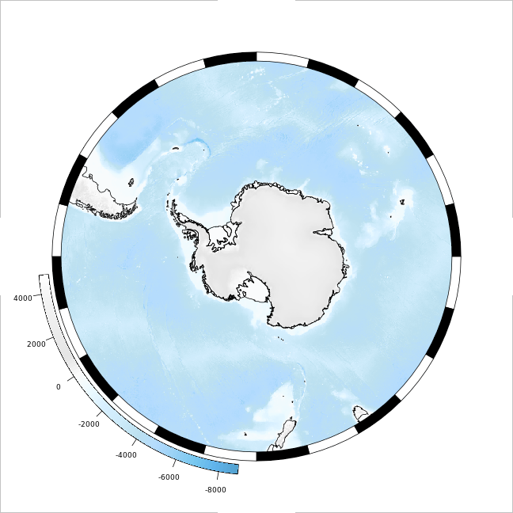
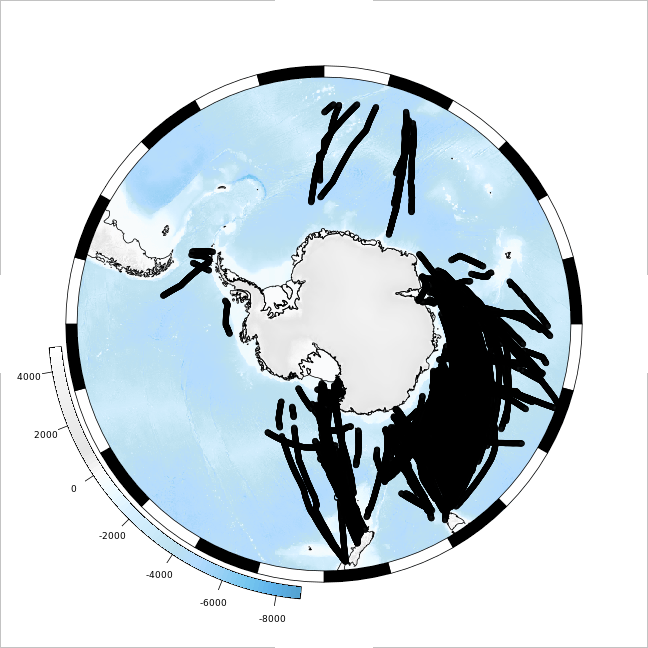
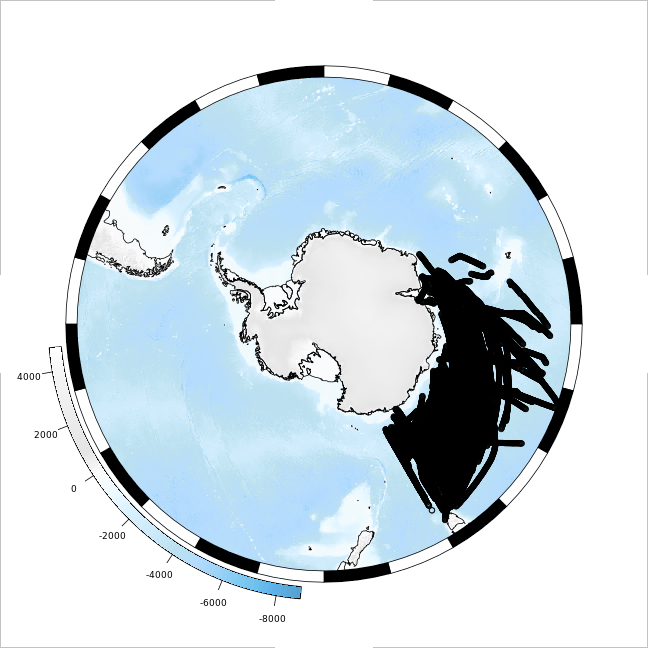
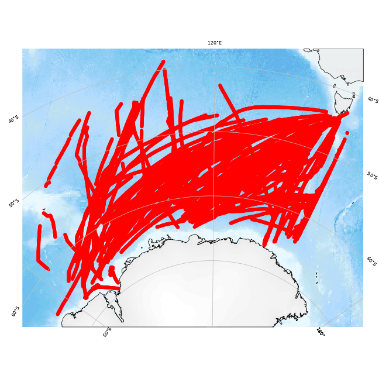
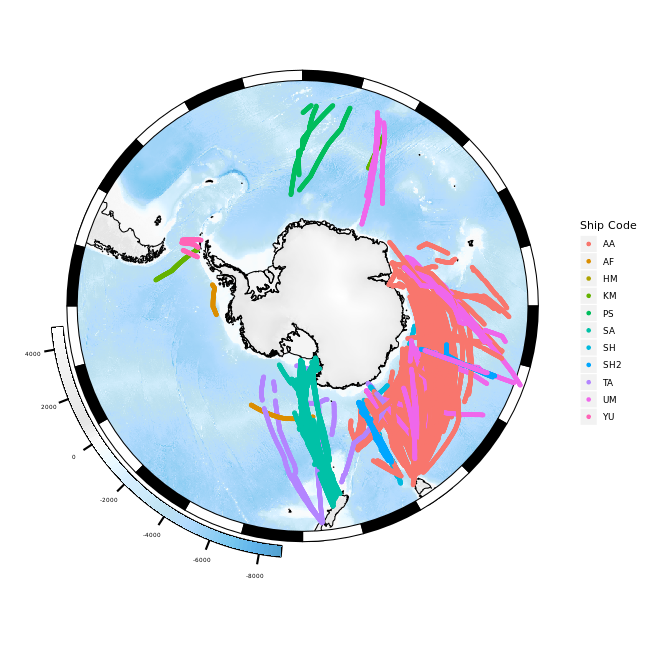
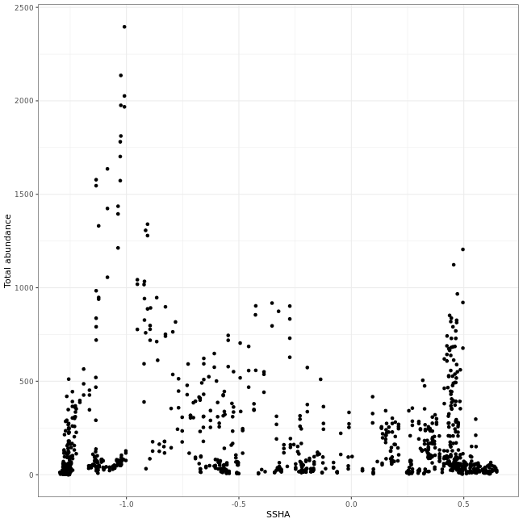

<!-- README.md is generated from README.Rmd. Please edit that file -->

# SOmap, SO-CPR data, and other things

Ben Raymond, AAD

November 2019

See also the SOmap section of the notes from [this R workshop](https://scar.github.io/EGABIcourse19/mapping.html#somap).

## Preparation

Install some packages if necessary:

``` r
have_pkg <- function(p) requireNamespace(p, quietly = TRUE)
github_pkgs <- c("AustralianAntarcticDivision/blueant", "AustralianAntarcticDivision/SOmap")
needed <- sapply(github_pkgs, function(z) !have_pkg(basename(z)))
if (any(needed)) {
  if (!have_pkg("remotes")) install.packages("remotes")
  for (p in github_pkgs[needed]) remotes::install_github(p)
}

pkgs <- c("data.table", "dplyr", "ggplot2", "lubridate")
needed <- !sapply(pkgs, have_pkg)
if (any(needed)) install.packages(pkgs[needed])
```

## Download the SO-CPR data and read it in

``` r
library(blueant)
library(data.table)
library(lubridate)

data_dir <- tempdir()
status <- bb_get(sources("SO-CPR"), local_file_root = data_dir)

x <- fread(status$files[[1]]$file, data.table = FALSE)
x$date <- dmy(x$Date)

## the data looks like
dplyr::glimpse(x)
#> Observations: 48,166
#> Variables: 307
#> $ `Tow Number`                            <dbl> 1, 1, 1, 1, 1, 1, 1, 1, 1, 1,…
#> $ `Ship Code`                             <chr> "AA", "AA", "AA", "AA", "AA",…
#> $ Time                                    <chr> "10:20", "10:43", "11:06", "1…
#> $ Date                                    <chr> "12-Jan-1991", "12-Jan-1991",…
#> $ Month                                   <chr> "January", "January", "Januar…
#> $ Year                                    <int> 1991, 1991, 1991, 1991, 1991,…
#> $ Season                                  <chr> "1990-91", "1990-91", "1990-9…
#> $ Latitude                                <dbl> -63.2795, -63.2829, -63.2865,…
#> $ Longitude                               <dbl> 88.3835, 88.2003, 88.0155, 87…
#> $ `Segment No.`                           <int> 1, 2, 3, 4, 5, 6, 7, 8, 9, 10…
#> $ `Segment Length`                        <dbl> 5.00, 5.00, 5.00, 5.00, 5.00,…
#> $ `Abylidae indet`                        <int> 0, 0, 0, 0, 0, 0, 0, 0, 0, 0,…
#> $ `Acartia (Acartia) danae`               <int> 0, 0, 0, 0, 0, 0, 0, 0, 0, 0,…
#> $ `Acartia (Acartiura) tranteri`          <int> 0, 0, 0, 0, 0, 0, 0, 0, 0, 0,…
#> $ `Acartia (Odontacartia) pacifica`       <int> 0, 0, 0, 0, 0, 0, 0, 0, 0, 0,…
#> $ `Acartia sp.`                           <int> 0, 0, 0, 0, 0, 0, 0, 0, 0, 0,…
#> $ `Aetideus australis`                    <int> 0, 0, 0, 0, 0, 0, 0, 0, 0, 0,…
#> $ `Aetideus sp.`                          <int> 0, 0, 0, 0, 0, 0, 0, 0, 0, 0,…
#> $ `Alciopidae indet`                      <int> 0, 0, 0, 0, 0, 0, 0, 0, 0, 0,…
#> $ `Amphipoda indet`                       <int> 0, 0, 0, 0, 0, 0, 0, 0, 0, 0,…
#> $ `Appendicularia indet`                  <int> 0, 0, 0, 0, 0, 0, 0, 0, 0, 0,…
#> $ `Bivalvia larvae`                       <int> 0, 0, 0, 0, 0, 0, 0, 0, 0, 0,…
#> $ `Brachyscelus crusculum`                <int> 0, 0, 0, 0, 0, 0, 0, 0, 0, 0,…
#> $ `Branchiopoda indet`                    <int> 0, 0, 0, 0, 0, 0, 0, 0, 0, 0,…
#> $ `Calanoida indet (small)`               <int> 0, 0, 0, 0, 0, 0, 0, 0, 0, 0,…
#> $ `Calanoides acutus`                     <int> 0, 0, 0, 0, 0, 0, 0, 0, 0, 0,…
#> $ `Calanoides brevicornis`                <int> 0, 0, 0, 0, 0, 0, 0, 0, 0, 0,…
#> $ `Calanoides sp.`                        <int> 0, 0, 0, 0, 0, 0, 0, 0, 0, 0,…
#> $ `Calanus australis`                     <int> 0, 0, 0, 0, 0, 0, 0, 0, 0, 0,…
#> $ `Calanus propinquus`                    <int> 0, 0, 0, 0, 0, 0, 0, 0, 0, 0,…
#> $ `Calanus simillimus`                    <int> 0, 0, 0, 0, 0, 0, 0, 0, 0, 0,…
#> $ `Calanus sp.`                           <int> 0, 0, 0, 0, 0, 0, 0, 0, 0, 0,…
#> $ `Calocalanus plumulosus`                <int> 0, 0, 0, 0, 0, 0, 0, 0, 0, 0,…
#> $ `Calocalanus sp.`                       <int> 0, 0, 0, 0, 0, 0, 0, 0, 0, 0,…
#> $ `Calocalanus styliremis`                <int> 0, 0, 0, 0, 0, 0, 0, 0, 0, 0,…
#> $ `Candacia bipinnata`                    <int> 0, 0, 0, 0, 0, 0, 0, 0, 0, 0,…
#> $ `Candacia cheirura`                     <int> 0, 0, 0, 0, 0, 0, 0, 0, 0, 0,…
#> $ `Candacia falcifera`                    <int> 0, 0, 0, 0, 0, 0, 0, 0, 0, 0,…
#> $ `Candacia maxima`                       <int> 0, 0, 0, 0, 0, 0, 0, 0, 0, 0,…
#> $ `Candacia sp.`                          <int> 0, 0, 0, 0, 0, 0, 0, 0, 0, 0,…
#> $ `Centropages aucklandicus`              <int> 0, 0, 0, 0, 0, 0, 0, 0, 0, 0,…
#> $ `Centropages bradyi`                    <int> 0, 0, 0, 0, 0, 0, 0, 0, 0, 0,…
#> $ `Centropages furcatus`                  <int> 0, 0, 0, 0, 0, 0, 0, 0, 0, 0,…
#> $ `Centropages sp.`                       <int> 0, 0, 0, 0, 0, 0, 0, 0, 0, 0,…
#> $ `Chaetognatha indet`                    <int> 0, 0, 0, 0, 0, 0, 1, 0, 0, 0,…
#> $ `Chelophyes sp.`                        <int> 0, 0, 0, 0, 0, 0, 0, 0, 0, 0,…
#> $ `Cirripedia cyprid`                     <int> 0, 0, 0, 0, 0, 0, 0, 0, 0, 0,…
#> $ `Cirripedia nauplius`                   <int> 0, 0, 0, 0, 0, 0, 0, 0, 0, 0,…
#> $ `Clausocalanus arcuicornis`             <int> 0, 0, 0, 0, 0, 0, 0, 0, 0, 0,…
#> $ `Clausocalanus brevipes`                <int> 0, 0, 0, 0, 0, 0, 0, 0, 0, 0,…
#> $ `Clausocalanus ingens`                  <int> 0, 0, 0, 0, 0, 0, 0, 0, 0, 0,…
#> $ `Clausocalanus laticeps`                <int> 0, 0, 0, 0, 0, 0, 0, 0, 0, 0,…
#> $ `Clausocalanus pergens`                 <int> 0, 0, 0, 0, 0, 0, 0, 0, 0, 0,…
#> $ `Clausocalanus sp.`                     <int> 0, 0, 0, 0, 0, 0, 0, 0, 0, 0,…
#> $ `Clio pyramidata`                       <int> 0, 0, 0, 0, 0, 0, 0, 0, 0, 0,…
#> $ `Clio sp.`                              <int> 0, 0, 0, 0, 0, 0, 0, 0, 0, 0,…
#> $ `Clione limacina antarctica`            <int> 0, 0, 0, 0, 0, 0, 0, 0, 0, 0,…
#> $ `Clione sp.`                            <int> 0, 0, 0, 0, 0, 0, 0, 0, 0, 0,…
#> $ `Clytemnestra scutellata`               <int> 0, 0, 0, 0, 0, 0, 0, 0, 0, 0,…
#> $ `Clytemnestra sp.`                      <int> 0, 0, 0, 0, 0, 0, 0, 0, 0, 0,…
#> $ `Cnidaria indet`                        <int> 0, 0, 0, 0, 0, 0, 0, 0, 0, 0,…
#> $ `Copepoda indet`                        <int> 0, 0, 0, 0, 0, 0, 0, 0, 0, 0,…
#> $ `Copepoda nauplius indet`               <int> 0, 0, 0, 0, 0, 0, 0, 0, 0, 0,…
#> $ `Crustacea nauplius indet`              <int> 0, 0, 0, 0, 0, 0, 0, 0, 0, 0,…
#> $ `Ctenocalanus citer`                    <int> 0, 0, 0, 0, 0, 0, 0, 0, 0, 0,…
#> $ `Ctenocalanus sp.`                      <int> 0, 0, 0, 0, 0, 0, 0, 0, 0, 0,…
#> $ `Ctenophora indet`                      <int> 0, 0, 0, 0, 0, 0, 0, 0, 0, 0,…
#> $ `Cumacea indet`                         <int> 0, 0, 0, 0, 0, 0, 0, 0, 0, 0,…
#> $ `Cyclopoida nauplius indet`             <int> 0, 0, 0, 0, 0, 0, 0, 0, 0, 0,…
#> $ `Cyllopus lucasii`                      <int> 0, 0, 0, 0, 0, 0, 0, 0, 0, 0,…
#> $ `Cyllopus magellanicus`                 <int> 0, 0, 0, 0, 0, 0, 0, 0, 0, 0,…
#> $ `Dairella californica`                  <int> 0, 0, 0, 0, 0, 0, 0, 0, 0, 0,…
#> $ `Decapoda (natant) indet juv`           <int> 0, 0, 0, 0, 0, 0, 0, 0, 0, 0,…
#> $ `Decapoda megalopa indet`               <int> 0, 0, 0, 0, 0, 0, 0, 0, 0, 0,…
#> $ `Decapoda nauplius indet`               <int> 0, 0, 0, 0, 0, 0, 0, 0, 0, 0,…
#> $ `Decapoda phyllosoma indet`             <int> 0, 0, 0, 0, 0, 0, 0, 0, 0, 0,…
#> $ `Decapoda zoea indet`                   <int> 0, 0, 0, 0, 0, 0, 0, 0, 0, 0,…
#> $ `Doliolidae indet`                      <int> 0, 0, 0, 0, 0, 0, 0, 0, 0, 0,…
#> $ `Drepanopus sp.`                        <int> 0, 0, 0, 0, 0, 0, 0, 0, 0, 0,…
#> $ `Echinoidea larvae`                     <int> 0, 0, 0, 0, 0, 0, 0, 0, 0, 0,…
#> $ `Egg indet`                             <int> 0, 0, 0, 0, 0, 0, 0, 0, 0, 0,…
#> $ `Egg mass`                              <int> 0, 0, 0, 0, 0, 0, 0, 0, 0, 0,…
#> $ `Euaugaptilus sp.`                      <int> 0, 0, 0, 0, 0, 0, 0, 0, 0, 0,…
#> $ `Eucalanus hyalinus`                    <int> 0, 0, 0, 0, 0, 0, 0, 0, 0, 0,…
#> $ `Eucalanus sp.`                         <int> 0, 0, 0, 0, 0, 0, 0, 0, 0, 0,…
#> $ `Euchirella rostrata`                   <int> 0, 0, 0, 0, 0, 0, 0, 0, 0, 0,…
#> $ `Euchirella rostromagna`                <int> 0, 0, 0, 0, 0, 0, 0, 0, 0, 0,…
#> $ `Euchirella sp.`                        <int> 0, 0, 0, 0, 0, 0, 0, 0, 0, 0,…
#> $ `Eukrohnia hamata`                      <int> 0, 0, 0, 0, 0, 0, 0, 0, 0, 0,…
#> $ `Euphausia crystallorophias`            <int> 0, 0, 0, 0, 0, 0, 0, 0, 0, 0,…
#> $ `Euphausia crystallorophias calyptopis` <int> 0, 0, 0, 0, 0, 0, 0, 0, 0, 0,…
#> $ `Euphausia crystallorophias furcilia`   <int> 0, 0, 0, 0, 0, 0, 0, 0, 0, 0,…
#> $ `Euphausia frigida`                     <int> 0, 0, 0, 0, 0, 0, 0, 0, 0, 0,…
#> $ `Euphausia frigida calyptopis`          <int> 0, 0, 0, 0, 0, 0, 0, 0, 0, 0,…
#> $ `Euphausia frigida furcilia`            <int> 0, 0, 0, 0, 0, 0, 0, 0, 0, 0,…
#> $ `Euphausia hanseni furcilia`            <int> 0, 0, 0, 0, 0, 0, 0, 0, 0, 0,…
#> $ `Euphausia longirostris`                <int> 0, 0, 0, 0, 0, 0, 0, 0, 0, 0,…
#> $ `Euphausia longirostris calyptopis`     <int> 0, 0, 0, 0, 0, 0, 0, 0, 0, 0,…
#> $ `Euphausia longirostris furcilia`       <int> 0, 0, 0, 0, 0, 0, 0, 0, 0, 0,…
#> $ `Euphausia lucens`                      <int> 0, 0, 0, 0, 0, 0, 0, 0, 0, 0,…
#> $ `Euphausia recurva`                     <int> 0, 0, 0, 0, 0, 0, 0, 0, 0, 0,…
#> $ `Euphausia similis`                     <int> 0, 0, 0, 0, 0, 0, 0, 0, 0, 0,…
#> $ `Euphausia similis furcilia`            <int> 0, 0, 0, 0, 0, 0, 0, 0, 0, 0,…
#> $ `Euphausia spinifera`                   <int> 0, 0, 0, 0, 0, 0, 0, 0, 0, 0,…
#> $ `Euphausia spinifera calyptopis`        <int> 0, 0, 0, 0, 0, 0, 0, 0, 0, 0,…
#> $ `Euphausia spinifera furcilia`          <int> 0, 0, 0, 0, 0, 0, 0, 0, 0, 0,…
#> $ `Euphausia superba`                     <int> 0, 1, 0, 0, 0, 1, 1, 2, 0, 0,…
#> $ `Euphausia superba C1`                  <int> 0, 0, 0, 0, 0, 0, 0, 0, 0, 0,…
#> $ `Euphausia superba C2`                  <int> 0, 0, 0, 0, 0, 0, 0, 0, 0, 0,…
#> $ `Euphausia superba C3`                  <int> 0, 0, 0, 0, 0, 0, 0, 0, 0, 0,…
#> $ `Euphausia superba calyptopis`          <int> 0, 0, 0, 0, 0, 0, 0, 0, 0, 0,…
#> $ `Euphausia superba F1`                  <int> 0, 0, 0, 0, 0, 0, 0, 0, 0, 0,…
#> $ `Euphausia superba F2`                  <int> 0, 0, 0, 0, 0, 0, 0, 0, 0, 0,…
#> $ `Euphausia superba F3`                  <int> 0, 0, 0, 0, 0, 0, 0, 0, 0, 0,…
#> $ `Euphausia superba F4`                  <int> 0, 0, 0, 0, 0, 0, 0, 0, 0, 0,…
#> $ `Euphausia superba F5`                  <int> 0, 0, 0, 0, 0, 0, 0, 0, 0, 0,…
#> $ `Euphausia superba F6`                  <int> 0, 0, 0, 0, 0, 0, 0, 0, 0, 0,…
#> $ `Euphausia superba furcilia`            <int> 0, 0, 0, 0, 0, 0, 0, 0, 0, 0,…
#> $ `Euphausia triacantha`                  <int> 0, 0, 0, 0, 0, 0, 0, 0, 0, 0,…
#> $ `Euphausia triacantha calyptopis`       <int> 0, 0, 0, 0, 0, 0, 0, 0, 0, 0,…
#> $ `Euphausia triacantha furcilia`         <int> 0, 0, 0, 0, 0, 0, 0, 0, 0, 0,…
#> $ `Euphausia vallentini`                  <int> 0, 0, 0, 0, 0, 0, 0, 0, 0, 0,…
#> $ `Euphausia vallentini calyptopis`       <int> 0, 0, 0, 0, 0, 0, 0, 0, 0, 0,…
#> $ `Euphausia vallentini furcilia`         <int> 0, 0, 0, 0, 0, 0, 0, 0, 0, 0,…
#> $ `Euphausiidae calyptopis indet`         <int> 0, 0, 0, 0, 0, 0, 0, 0, 0, 0,…
#> $ `Euphausiidae furcilia indet`           <int> 0, 0, 0, 0, 0, 0, 0, 0, 0, 0,…
#> $ `Euphausiidae indet`                    <int> 0, 0, 0, 0, 0, 0, 0, 0, 0, 0,…
#> $ `Euphausiidae metanauplius indet`       <int> 0, 0, 0, 0, 0, 0, 0, 0, 0, 0,…
#> $ `Euphausiidae nauplius indet`           <int> 0, 0, 0, 0, 0, 0, 0, 0, 0, 0,…
#> $ `Euterpina sp.`                         <int> 0, 0, 0, 0, 0, 0, 0, 0, 0, 0,…
#> $ `Evadne sp.`                            <int> 0, 0, 0, 0, 0, 0, 0, 0, 0, 0,…
#> $ `Farranula sp.`                         <int> 0, 0, 0, 0, 0, 0, 0, 0, 0, 0,…
#> $ `Foraminifera indet`                    <int> 0, 0, 0, 0, 0, 0, 0, 0, 0, 0,…
#> $ `Fritillaria sp.`                       <int> 0, 0, 0, 0, 0, 0, 0, 0, 0, 0,…
#> $ `Gastropoda indet`                      <int> 0, 0, 0, 0, 0, 0, 0, 0, 0, 0,…
#> $ `Globigerina bulloides`                 <int> 0, 0, 0, 0, 0, 0, 0, 0, 0, 0,…
#> $ `Globigerinita uvula`                   <int> 0, 0, 0, 0, 0, 0, 0, 0, 0, 0,…
#> $ `Globorotalia sp.`                      <int> 0, 0, 0, 0, 0, 0, 0, 0, 0, 0,…
#> $ `Haloptilus oxycephalus`                <int> 0, 0, 0, 0, 0, 0, 0, 0, 0, 0,…
#> $ `Harpacticoida indet`                   <int> 0, 0, 0, 0, 0, 0, 0, 0, 0, 0,…
#> $ `Hemityphis sp.`                        <int> 0, 0, 0, 0, 0, 0, 0, 0, 0, 0,…
#> $ `Heterorhabdus austrinus`               <int> 0, 0, 0, 0, 0, 0, 0, 0, 0, 0,…
#> $ `Heterorhabdus lobatus`                 <int> 0, 0, 0, 0, 0, 0, 0, 0, 0, 0,…
#> $ `Heterorhabdus sp.`                     <int> 0, 0, 0, 0, 0, 0, 0, 0, 0, 0,…
#> $ `Heterorhabdus spinifrons`              <int> 0, 0, 0, 0, 0, 0, 0, 0, 0, 0,…
#> $ `Hyperia sp.`                           <int> 0, 0, 0, 0, 0, 0, 0, 0, 0, 0,…
#> $ `Hyperia spinigera`                     <int> 0, 0, 0, 0, 0, 0, 0, 0, 0, 0,…
#> $ `Hyperiella antarctica`                 <int> 0, 0, 0, 0, 0, 0, 0, 0, 0, 0,…
#> $ `Hyperiella dilatata`                   <int> 0, 0, 0, 0, 0, 0, 0, 0, 0, 0,…
#> $ `Hyperiella sp.`                        <int> 0, 0, 0, 0, 0, 0, 0, 0, 0, 0,…
#> $ `Hyperiidae indet`                      <int> 0, 0, 0, 0, 0, 0, 0, 0, 0, 0,…
#> $ `Hyperoche medusarum`                   <int> 0, 0, 0, 0, 0, 0, 0, 0, 0, 0,…
#> $ `Hyperoche sp.`                         <int> 0, 0, 0, 0, 0, 0, 0, 0, 0, 0,…
#> $ `Iospilidae indet`                      <int> 0, 0, 0, 0, 0, 0, 0, 0, 0, 0,…
#> $ `Isopoda indet`                         <int> 0, 0, 0, 0, 0, 0, 0, 0, 0, 0,…
#> $ `Lensia sp.`                            <int> 0, 0, 0, 0, 0, 0, 0, 0, 0, 0,…
#> $ `Limacina sp.`                          <int> 0, 0, 0, 0, 0, 0, 0, 0, 0, 0,…
#> $ `Lopadorrhynchidae indet`               <int> 0, 0, 0, 0, 0, 0, 0, 0, 0, 0,…
#> $ `Lubbockia sp.`                         <int> 0, 0, 0, 0, 0, 0, 0, 0, 0, 0,…
#> $ `Lucicutia flavicornis`                 <int> 0, 0, 0, 0, 0, 0, 0, 0, 0, 0,…
#> $ `Lucicutia sp.`                         <int> 0, 0, 0, 0, 0, 0, 0, 0, 0, 0,…
#> $ `Maupasia sp.`                          <int> 0, 0, 0, 0, 0, 0, 0, 0, 0, 0,…
#> $ `Mecynocera clausi`                     <int> 0, 0, 0, 0, 0, 0, 0, 0, 0, 0,…
#> $ `Mecynocera sp.`                        <int> 0, 0, 0, 0, 0, 0, 0, 0, 0, 0,…
#> $ `Mesocalanus sp.`                       <int> 0, 0, 0, 0, 0, 0, 0, 0, 0, 0,…
#> $ `Mesocalanus tenuicornis`               <int> 0, 0, 0, 0, 0, 0, 0, 0, 0, 0,…
#> $ `Metridia gerlachei`                    <int> 0, 0, 0, 0, 0, 0, 0, 0, 0, 0,…
#> $ `Metridia lucens`                       <int> 0, 0, 0, 0, 0, 0, 0, 0, 0, 0,…
#> $ `Metridia sp.`                          <int> 0, 0, 0, 0, 0, 0, 0, 0, 0, 0,…
#> $ `Microcalanus pygmaeus`                 <int> 0, 0, 0, 0, 0, 0, 0, 0, 0, 0,…
#> $ `Microsetella norvegica`                <int> 0, 0, 0, 0, 0, 0, 0, 0, 0, 0,…
#> $ `Microsetella rosea`                    <int> 0, 0, 0, 0, 0, 0, 0, 0, 0, 0,…
#> $ `Microsetella sp.`                      <int> 0, 0, 0, 0, 0, 0, 0, 0, 0, 0,…
#> $ `Munida gregaria`                       <int> 0, 0, 0, 0, 0, 0, 0, 0, 0, 0,…
#> $ `Myctophidae indet`                     <int> 0, 0, 0, 0, 0, 0, 0, 0, 0, 0,…
#> $ `Mysidae indet`                         <int> 0, 0, 0, 0, 0, 0, 0, 0, 0, 0,…
#> $ `Nannocalanus minor`                    <int> 0, 0, 0, 0, 0, 0, 0, 0, 0, 0,…
#> $ `Nauplius indet`                        <int> 0, 0, 0, 0, 0, 0, 0, 0, 0, 0,…
#> $ `Nematocarcinus longirostris`           <int> 0, 0, 0, 0, 0, 0, 0, 0, 0, 0,…
#> $ `Nematoscelis megalops`                 <int> 0, 0, 0, 0, 0, 0, 0, 0, 0, 0,…
#> $ `Neocalanus gracilis`                   <int> 0, 0, 0, 0, 0, 0, 0, 0, 0, 0,…
#> $ `Neocalanus tonsus`                     <int> 0, 0, 0, 0, 0, 0, 0, 0, 0, 0,…
#> $ `Neogloboquadrina incompta`             <int> 0, 0, 0, 0, 0, 0, 0, 0, 0, 0,…
#> $ `Neogloboquadrina pachyderma`           <int> 0, 0, 0, 0, 0, 0, 0, 0, 0, 0,…
#> $ `Noctiluca scintillans`                 <int> 0, 0, 0, 0, 0, 0, 0, 0, 0, 0,…
#> $ `Nyctiphanes australis`                 <int> 0, 0, 0, 0, 0, 0, 0, 0, 0, 0,…
#> $ `Nyctiphanes australis calyptopis`      <int> 0, 0, 0, 0, 0, 0, 0, 0, 0, 0,…
#> $ `Nyctiphanes australis furcilia`        <int> 0, 0, 0, 0, 0, 0, 0, 0, 0, 0,…
#> $ `Oculosetella gracilis`                 <int> 0, 0, 0, 0, 0, 0, 0, 0, 0, 0,…
#> $ `Oikopleura sp.`                        <int> 0, 0, 0, 0, 0, 0, 0, 0, 0, 0,…
#> $ `Oithona atlantica`                     <int> 0, 0, 0, 0, 0, 0, 0, 0, 0, 0,…
#> $ `Oithona frigida`                       <int> 0, 0, 0, 0, 0, 0, 0, 0, 0, 0,…
#> $ `Oithona longispina`                    <int> 0, 0, 0, 0, 0, 0, 0, 0, 0, 0,…
#> $ `Oithona similis`                       <int> 0, 0, 0, 0, 0, 0, 0, 0, 0, 0,…
#> $ `Oithona sp.`                           <int> 0, 0, 0, 0, 0, 0, 0, 0, 0, 0,…
#> $ `Oncaea curvata`                        <int> 0, 0, 0, 0, 0, 0, 0, 0, 0, 0,…
#> $ `Oncaea mediterranea`                   <int> 0, 0, 0, 0, 0, 0, 0, 0, 0, 0,…
#> $ `Oncaea sp.`                            <int> 0, 0, 0, 0, 0, 0, 0, 0, 0, 0,…
#> $ `Oncaea venusta typica`                 <int> 0, 0, 0, 0, 0, 0, 0, 0, 0, 0,…
#> $ `Onchocalanus sp.`                      <int> 0, 0, 0, 0, 0, 0, 0, 0, 0, 0,…
#> $ `Ostracoda indet`                       <int> 0, 0, 0, 0, 0, 0, 0, 0, 0, 0,…
#> $ `Paracalanus aculeatus`                 <int> 0, 0, 0, 0, 0, 0, 0, 0, 0, 0,…
#> $ `Paracalanus indicus`                   <int> 0, 0, 0, 0, 0, 0, 0, 0, 0, 0,…
#> $ `Paracalanus sp.`                       <int> 0, 0, 0, 0, 0, 0, 0, 0, 0, 0,…
#> $ `Paraeuchaeta antarctica`               <int> 0, 0, 0, 0, 0, 0, 0, 0, 0, 0,…
#> $ `Paraeuchaeta barbata`                  <int> 0, 0, 0, 0, 0, 0, 0, 0, 0, 0,…
#> $ `Paraeuchaeta biloba`                   <int> 0, 0, 0, 0, 0, 0, 0, 0, 0, 0,…
#> $ `Paraeuchaeta exigua`                   <int> 0, 0, 0, 0, 0, 0, 0, 0, 0, 0,…
#> $ `Paraeuchaeta sp.`                      <int> 0, 0, 0, 0, 0, 0, 0, 0, 0, 0,…
#> $ `Paraheterorhabdus farrani`             <int> 0, 0, 0, 0, 0, 0, 0, 0, 0, 0,…
#> $ `Paralabidocera antarctica`             <int> 0, 0, 0, 0, 0, 0, 0, 0, 0, 0,…
#> $ `Pelagobia longicirrata`                <int> 0, 0, 0, 0, 0, 0, 0, 0, 0, 0,…
#> $ `Phalacrophorus pictus`                 <int> 0, 0, 0, 0, 0, 0, 0, 0, 0, 0,…
#> $ `Phalacrophorus sp.`                    <int> 0, 0, 0, 0, 0, 0, 0, 0, 0, 0,…
#> $ `Phronima sp.`                          <int> 0, 0, 0, 0, 0, 0, 0, 0, 0, 0,…
#> $ `Pisces egg`                            <int> 0, 0, 0, 0, 0, 0, 0, 0, 0, 0,…
#> $ `Pisces larvae`                         <int> 0, 0, 0, 0, 0, 0, 0, 0, 0, 0,…
#> $ `Platysceloidea indet`                  <int> 0, 0, 0, 0, 0, 0, 0, 0, 0, 0,…
#> $ `Pleuragramma antarctica`               <int> 0, 0, 0, 0, 0, 0, 0, 0, 0, 0,…
#> $ `Pleuromamma abdominalis`               <int> 0, 0, 0, 0, 0, 0, 0, 0, 0, 0,…
#> $ `Pleuromamma borealis`                  <int> 0, 0, 0, 0, 0, 0, 0, 0, 0, 0,…
#> $ `Pleuromamma gracilis`                  <int> 0, 0, 0, 0, 0, 0, 0, 0, 0, 0,…
#> $ `Pleuromamma piseki`                    <int> 0, 0, 0, 0, 0, 0, 0, 0, 0, 0,…
#> $ `Pleuromamma robusta`                   <int> 0, 0, 0, 0, 0, 0, 0, 0, 0, 0,…
#> $ `Pleuromamma sp.`                       <int> 0, 0, 0, 0, 0, 0, 0, 0, 0, 0,…
#> $ `Pleuromamma xiphias`                   <int> 0, 0, 0, 0, 0, 0, 0, 0, 0, 0,…
#> $ `Podon sp.`                             <int> 0, 0, 0, 0, 0, 0, 0, 0, 0, 0,…
#> $ `Polychaeta indet`                      <int> 0, 0, 0, 0, 0, 0, 0, 0, 0, 0,…
#> $ `Polychaeta larvae`                     <int> 0, 0, 0, 0, 0, 0, 0, 0, 0, 0,…
#> $ `Primno macropa`                        <int> 0, 0, 0, 0, 0, 0, 0, 0, 0, 0,…
#> $ `Protomyctophum sp.`                    <int> 0, 0, 0, 0, 0, 0, 0, 0, 0, 0,…
#> $ `Pseudosagitta gazellae`                <int> 0, 0, 0, 0, 0, 0, 0, 0, 0, 0,…
#> $ `Pseudosagitta sp.`                     <int> 0, 0, 0, 0, 0, 0, 0, 0, 0, 0,…
#> $ `Pteropoda indet`                       <int> 0, 0, 0, 0, 0, 0, 0, 0, 0, 0,…
#> $ `Pyrosomatidae indet`                   <int> 0, 0, 0, 0, 0, 0, 0, 0, 0, 0,…
#> $ `Radiozoa indet`                        <int> 0, 0, 0, 0, 0, 0, 0, 0, 0, 0,…
#> $ `Rhincalanus gigas`                     <int> 0, 0, 0, 0, 0, 0, 0, 0, 0, 0,…
#> $ `Rhincalanus gigas nauplius`            <int> 0, 0, 0, 0, 0, 0, 0, 0, 0, 0,…
#> $ `Rhincalanus nasutus`                   <int> 0, 0, 0, 0, 0, 0, 0, 0, 0, 0,…
#> $ `Rhincalanus sp.`                       <int> 0, 0, 0, 0, 0, 0, 0, 0, 0, 0,…
#> $ `Sagittidae indet`                      <int> 0, 0, 0, 0, 0, 0, 0, 0, 0, 0,…
#> $ `Salpa fusiformis`                      <int> 0, 0, 0, 0, 0, 0, 0, 0, 0, 0,…
#> $ `Salpa thompsoni`                       <int> 0, 0, 0, 0, 0, 0, 0, 0, 0, 0,…
#> $ `Salpidae indet`                        <int> 0, 0, 0, 0, 0, 0, 0, 0, 0, 0,…
#> $ `Sapphirina nigromaculata`              <int> 0, 0, 0, 0, 0, 0, 0, 0, 0, 0,…
#> $ `Sapphirina sp.`                        <int> 0, 0, 0, 0, 0, 0, 0, 0, 0, 0,…
#> $ `Scaphocalanus echinatus`               <int> 0, 0, 0, 0, 0, 0, 0, 0, 0, 0,…
#> $ `Scaphocalanus farrani`                 <int> 0, 0, 0, 0, 0, 0, 0, 0, 0, 0,…
#> $ `Scina sp.`                             <int> 0, 0, 0, 0, 0, 0, 0, 0, 0, 0,…
#> $ `Scolecithricella minor`                <int> 0, 0, 0, 0, 0, 0, 0, 0, 0, 0,…
#> $ `Scolecithricella sp.`                  <int> 0, 0, 0, 0, 0, 0, 0, 0, 0, 0,…
#> $ `Sergestidae indet`                     <int> 0, 0, 0, 0, 0, 0, 0, 0, 0, 0,…
#> $ `Siphonophora nectophore`               <int> 0, 0, 0, 0, 0, 0, 0, 0, 0, 0,…
#> $ `Siphonophora sp.`                      <int> 0, 0, 0, 0, 0, 0, 0, 0, 0, 0,…
#> $ `Soestia zonaria`                       <int> 0, 0, 0, 0, 0, 0, 0, 0, 0, 0,…
#> $ `Solidosagitta marri`                   <int> 0, 0, 0, 0, 0, 0, 0, 0, 0, 0,…
#> $ `Solmundella bitentaculata`             <int> 0, 0, 0, 0, 0, 0, 0, 0, 0, 0,…
#> $ `Spongiobranchaea australis`            <int> 0, 0, 0, 0, 0, 0, 0, 0, 0, 0,…
#> $ `Squilla sp.`                           <int> 0, 0, 0, 0, 0, 0, 0, 0, 0, 0,…
#> $ `Stephos longipes`                      <int> 0, 0, 0, 0, 0, 0, 0, 0, 0, 0,…
#> $ `Subeucalanus longiceps`                <int> 0, 0, 0, 0, 0, 0, 0, 0, 0, 0,…
#> $ `Subeucalanus sp.`                      <int> 0, 0, 0, 0, 0, 0, 0, 0, 0, 0,…
#> $ `Sulcanus conflictus`                   <int> 0, 0, 0, 0, 0, 0, 0, 0, 0, 0,…
#> $ `Temora turbinata`                      <int> 0, 0, 0, 0, 0, 0, 0, 0, 0, 0,…
#> $ `Teuthida indet`                        <int> 0, 0, 0, 0, 0, 0, 0, 0, 0, 0,…
#> $ `Thalia sp.`                            <int> 0, 0, 0, 0, 0, 0, 0, 0, 0, 0,…
#> $ `Themisto australis`                    <int> 0, 0, 0, 0, 0, 0, 0, 0, 0, 0,…
#> $ `Themisto gaudichaudii`                 <int> 0, 0, 0, 0, 0, 0, 0, 0, 0, 0,…
#> $ `Themisto sp.`                          <int> 0, 0, 0, 0, 0, 0, 0, 0, 0, 0,…
#> $ `Thysanoessa gregaria`                  <int> 0, 0, 0, 0, 0, 0, 0, 0, 0, 0,…
#> $ `Thysanoessa gregaria calyptopis`       <int> 0, 0, 0, 0, 0, 0, 0, 0, 0, 0,…
#> $ `Thysanoessa gregaria furcilia`         <int> 0, 0, 0, 0, 0, 0, 0, 0, 0, 0,…
#> $ `Thysanoessa macrura`                   <int> 0, 0, 0, 0, 0, 0, 2, 7, 8, 7,…
#> $ `Thysanoessa macrura C1`                <int> 0, 0, 0, 0, 0, 0, 0, 0, 0, 0,…
#> $ `Thysanoessa macrura C2`                <int> 0, 0, 0, 0, 0, 0, 0, 0, 0, 0,…
#> $ `Thysanoessa macrura C3`                <int> 0, 0, 0, 0, 0, 0, 0, 0, 0, 0,…
#> $ `Thysanoessa macrura calyptopis`        <int> 0, 0, 0, 0, 0, 0, 0, 0, 0, 0,…
#> $ `Thysanoessa macrura F1`                <int> 0, 0, 0, 0, 0, 0, 0, 0, 0, 0,…
#> $ `Thysanoessa macrura F2`                <int> 0, 0, 0, 0, 0, 0, 0, 0, 0, 0,…
#> $ `Thysanoessa macrura F3`                <int> 0, 0, 0, 0, 0, 0, 0, 0, 0, 0,…
#> $ `Thysanoessa macrura F4`                <int> 0, 0, 0, 0, 0, 0, 0, 0, 0, 0,…
#> $ `Thysanoessa macrura F5`                <int> 0, 0, 0, 0, 0, 0, 0, 0, 0, 0,…
#> $ `Thysanoessa macrura F6`                <int> 0, 0, 0, 0, 0, 0, 0, 0, 0, 0,…
#> $ `Thysanoessa macrura furcilia`          <int> 0, 0, 0, 0, 0, 0, 0, 0, 0, 0,…
#> $ `Thysanoessa macrura metanauplius`      <int> 0, 0, 0, 0, 0, 0, 0, 0, 0, 0,…
#> $ `Thysanoessa sp.`                       <int> 0, 0, 0, 0, 0, 0, 0, 0, 0, 0,…
#> $ `Thysanoessa sp. furcilia`              <int> 0, 0, 0, 0, 0, 0, 0, 0, 0, 0,…
#> $ `Tintinnina indet`                      <int> 0, 0, 0, 0, 0, 0, 0, 0, 0, 0,…
#> $ `Tomopteris carpenteri`                 <int> 0, 0, 0, 0, 0, 0, 0, 0, 0, 0,…
#> $ `Tomopteris sp.`                        <int> 0, 0, 0, 0, 0, 0, 0, 0, 0, 0,…
#> $ `Travisiopsis levinseni`                <int> 0, 0, 0, 0, 0, 0, 0, 0, 0, 0,…
#> $ `Travisiopsis sp.`                      <int> 0, 0, 0, 0, 0, 0, 0, 0, 0, 0,…
#> $ `Triconia antarctica`                   <int> 0, 0, 0, 0, 0, 0, 0, 0, 0, 0,…
#> $ `Turborotalita quinqueloba`             <int> 0, 0, 0, 0, 0, 0, 0, 0, 0, 0,…
#> $ `Typhloscolex muelleri`                 <int> 0, 0, 0, 0, 0, 0, 0, 0, 0, 0,…
#> $ `Vanadis antarctica`                    <int> 0, 0, 0, 0, 0, 0, 0, 0, 0, 0,…
#> $ `Vanadis longissima`                    <int> 0, 0, 0, 0, 0, 0, 0, 0, 0, 0,…
#> $ `Vibilia antarctica`                    <int> 0, 0, 0, 0, 0, 0, 0, 0, 0, 0,…
#> $ `Vibilia armata`                        <int> 0, 0, 0, 0, 0, 0, 0, 0, 0, 0,…
#> $ `Vibilia sp.`                           <int> 0, 0, 0, 0, 0, 0, 0, 0, 0, 0,…
#> $ `Total abundance`                       <int> 0, 1, 0, 0, 0, 1, 4, 9, 8, 7,…
#> $ Phytoplankton_Colour_Index              <chr> "-", "-", "-", "-", "-", "-",…
#> $ Fluorescence                            <chr> "15.18", "8.97", "7.81", "9.3…
#> $ Salinity                                <chr> "33.91", "33.91", "33.90", "3…
#> $ Water_Temperature                       <chr> "3.38", "3.33", "3.40", "3.29…
#> $ Photosynthetically_Active_Radiation     <chr> "-", "-", "-", "-", "-", "-",…
#> $ date                                    <date> 1991-01-12, 1991-01-12, 1991…
```

## Semi-automatic maps

Just a base map:

``` r
library(SOmap)

SOmap(trim = -40)
```



To which we can add stuff:

``` r
SOmap(trim = -40)
SOplot(x$Longitude, x$Latitude)
```



## A subset of the data

An East Antarctic subset of the data:

``` r
xsub <- x[x$Longitude >= 50 & x$Longitude <= 150, ]

SOmap(trim = -40)
SOplot(xsub$Longitude, xsub$Latitude)
```



Maybe better on something other than full polar-stereo
projection?

``` r
SOmap_auto(xsub$Longitude, xsub$Latitude, input_lines = FALSE)
```



## More complicated

``` r
library(ggplot2)
## make a base ggplot2 map
p <- SOgg(SOmap(trim = -40))

## get projected coordinates for our data
px <- SOproj(x$Longitude, x$Latitude, target = p$projection)
x <- cbind(x, coordinates(px))

## plot the map and add points with colour by ship code
plot(p) + geom_point(data = x, aes(colour = `Ship Code`))
```



## Other R stuff

The [SOmap package](https://github.com/AustralianAntarcticDivision/) is
part of a larger suite of packages to support science in the Southern
Ocean and Antarctica. See the [SCAR/rOpenSci
initiative](https://ropensci.org/blog/2018/11/13/antarctic/) for more
information.

The
[RAADtools](https://github.com/AustralianAntarcticDivision/raadtools)
package provides tools for working with a suite of (mostly Southern
Ocean) environmental data.

Using the last 1000 rows only as an example, we use `raadtools` to
extract time- and location-matched sea surface height anomaly data:

``` r
library(raadtools)
#> global option 'raadfiles.data.roots' set:
#> '/rdsi/PRIVATE/raad/data               2019-11-25 16:35:10
#>  /rdsi/PRIVATE/raad/data_local         2019-11-25 16:38:29
#>  /rdsi/PRIVATE/raad/data_staging       2019-11-25 16:38:30
#>  /rdsi/PRIVATE/raad/data_deprecated    2019-11-25 16:38:31
#>  /rdsi/PUBLIC/raad/data                2019-11-25 16:55:01'

xsub <- tail(x, 1000)
xsub$SSHA <- extract(readssh, tail(x[, c("Longitude", "Latitude", "date")], 1000), anomaly = TRUE)
```

Plotted against total abundance:

``` r
ggplot(xsub, aes(SSHA, `Total abundance`)) + geom_point() + theme_bw()
#> Warning: Removed 23 rows containing missing values (geom_point).
```


